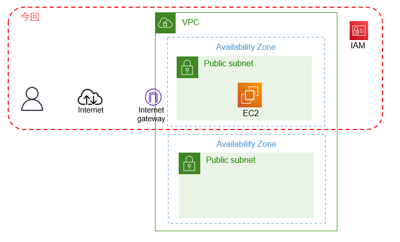

# spring-boot2-aws-terraform

GitHubからAWSへの自動デプロイに挑戦

## やりたいこと
* EC2インスタンスのみで動作するWEBアプリケーションをAWSへデプロイしたい
* AWSへのデプロイを自動化したい
* AWSのネットワーク構築を自動化したい
* アプリケーションのビルド～デプロイ～起動まで自動化したい

## AWS構成

## 前提
Terraformで実施したいことが、手動で実施できること  
手動で実施できないのであれば、まず手動で実施できるようになるべし  

## 準備

1. GitHub
	1. アカウント登録（無料プラン有り）
	1. リポジトリ作成（WEBアプリケーションを格納するリポジトリ。tfファイルと同じリポジトリでもOK）
	1. リポジトリ作成（Terraform用のtfファイルを格納するリポジトリ）
1. AWS
	1. アカウント登録（1年間の無料枠付き有り。クレジットカード必要）
	1. terraform向け準備としてIAMにて、新規ユーザ作成及びアクセスキー作成を行う  
	   ユーザには、VPCとEC2についてフルアクセスできる権限を付けておくこと  
	   アクセスキーは端末にダウンロードし厳重に管理する  
	   Terraform CloudのWorkspace作成時にアクセスキーを使用する  
	1. 事前にEC2インスタンス用SSHキーペア（pemファイル）を作成し、端末にダウンロードし厳重に管理する  
	   pemファイルはEC2インスタンスにSSHログインする時に使用する  
	   今回は`green`という名前をキーペアに使用する  
	   ダウンロードファイル名は`green.pem`となる  
1. Terraform Cloud
	1. アカウント登録（無料プラン有り）
	1. Workspace作成
	1. GitHubリポジトリ登録（tfファイルを格納するリポジトリ）  
       リポジトリを登録すると、GitHub側のsettingでもTerraformを利用していることが分かるようになる  
	   登録時に全てのリポジトリ又は指定リポジトリを選ぶ。
	   指定リポジトリにした場合には、次の別のリポジトリを追加登録する際には、GitHub側で対象を追加しておく必要がある点に注意  
	1. AWSアクセスキー登録  
	   `Access key ID`, `Secret access key`を登録する  
	   セキュアなチェックをつけるべし  

## WEBアプリケーション作成
今回はEC2インスタンスのみで単独起動できるWEBアプリケーションを作成し、GitHubリポジトリへ格納する  
今回は以下のspring-bootアプリケーションを使用  
https://github.com/namickey/spring-boot2-train  

## tfファイル作成
VPC用、EC2作成用tfファイル作成、登録したGitHubリポジトリに格納する  
今回は本リポジトリに格納しているtfファイル2つとEC2インスタンスのセットアップ用シェルファイルを使用する  
* `vpc.tf`  
* `ec2.tf`  
* `setup.sh`  
今回、キーワードとして全ての名称に`green`という単語を付与している  

## TerraformCloudからデプロイ
VPC作成+EC2作成+アプリケーションのビルド～デプロイ～起動まで自動化  

1. plan
1. apply
1. 作成されたEC2インスタンスの`公開用IPアドレス`を確認  
   apply完了後のoutputに`公開用IPアドレス`が出力される  
1. 念のため、AWSコンソールにて結果確認  
   EC2インスタンスが作成されていること  
   初期化完了まで待てば、アプリケーションが自動起動する  
1. ブラウザ動作確認  
   `http://公開用IPアドレス:8080`
1. SSH接続確認  
   `ssh -i <pemファイル名> ec2-user@公開用IPアドレス`
1. destroy
1. 念のため、AWSコンソールにて結果確認  
   EC2インスタンスが削除されていること  

## 参考サイト：Terraform

Terraform Cloudの始め方  
https://qiita.com/boccham/items/190f04bfbc9ffc0b5baf  

Terraformで構築するAWS  
https://y-ohgi.com/introduction-terraform/handson/vpc/  

terraform構築手順〜EC2編〜  
https://colabmix.co.jp/tech-blog/terraform-ec2/  

TerraformでEC2インスタンスを構築してみた。（Terraform, AWS, EC2）  
https://qiita.com/takahashi-kazuki/items/c2fe3d70e3a9490adf64  

## 参考サイト：AWSを手動で構築する場合

【AWS①】ネットワークを構築してみる  
https://zenn.dev/oreo2990/articles/bf3112bb6ccb48  

【AWS】EC2インスタンスの作成方法解説！サーバーを作成して接続してみる  
https://engineer-ninaritai.com/aws-ec2-make/  

## 参考サイト

AWS VPCルーティングの基本から発展構成例  
http://blog.father.gedow.net/2023/07/11/aws-vpc-routing/  

AWSコスト削減とリソース管理  
https://blog.father.gedow.net/2023/08/24/aws-cost-saving/  
